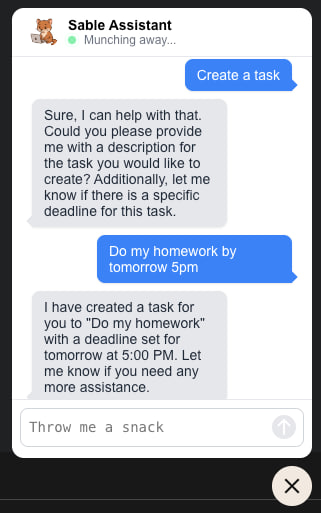
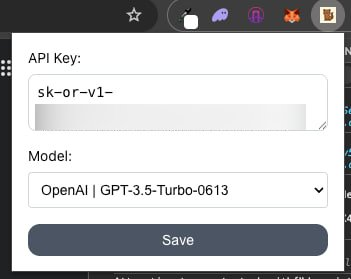

# Sable AI Assistant

A browser-injected chatbot interface powered by a LLM via the OpenRouter API. The chatbot intelligently parses user conversations and triggers contextual tool_calls functions, enabling seamless integration with backend services for dynamic, action-oriented responses within any web environment.

  
   
  <em>Figure 1: User is able to interact with the bot like creating a task</em>

  
   
  <em>Figure 2: User may key in their OpenRouter API Key and to select which model that they want to use</em>

## How to use

1. Perform `npm run build`
2. Go to Chrome Extension and import the `dist` folder
3. Within the Extension Pop up, add in your OpenRouter API Key and select the model
4. Ensure that your OpenRouter has sufficient credits if you want to use ChatGPT model (at the moment only ChatGPT models support tool_calls)

## Connect your own backend functionality

1. Add in your tool_calls schema in `content-script/src/service/tools/schema.ts`
2. Add in your backend calls in `executeToolCall` function under `content-script/src/service/tools/index.ts`

## Challenges

### Styles

Initially for the boilerplate, it was configured using Tailwind. However, when the HTML is injected in various browsers, there was a conflict between how the classes were defined in Tailwind compared to the current viewing site. Hence, Tailwind was removed from the project and replaced with simple css.

### LLM Understanding

This project is my first attempt working with LLMs. The challenge was getting the LLM to not assume any parameters and always clarify with the user on any missing parameters before calling the tools.

## References

This code base was cloned from [Boilerplate](https://github.com/yosevu/react-content-script)
